# OpengGL_exercise
*for personal learning by Secdoge*

## ##Firstly

opengl3.3 glfw glad glm 

## ##opengl_01

first attempt in OpenGL

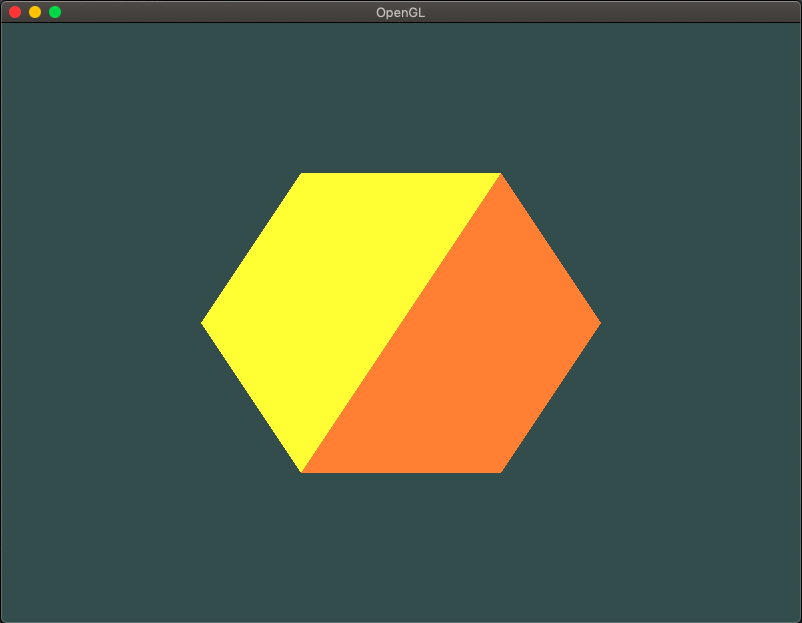

## ##opengl_02

colors changing related to positions

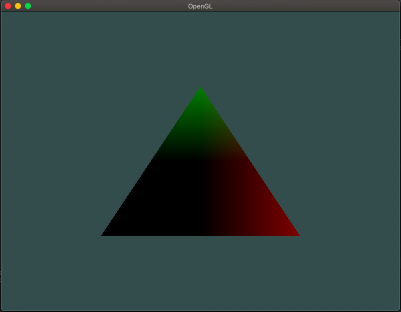

## ##opengl_03

textures changing by pressing ↑&↓

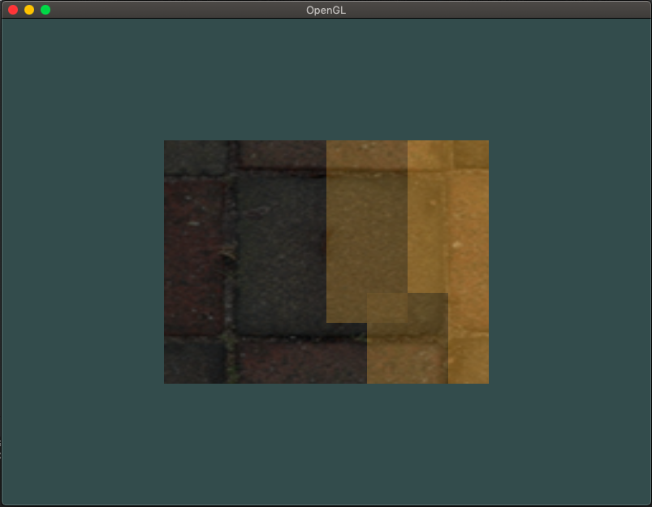

## ##opengl_04

build a scene with boxes and some of them spining

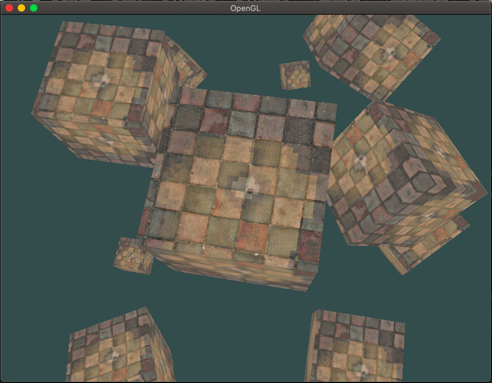

## ##opengl_05

camera moving with WASD

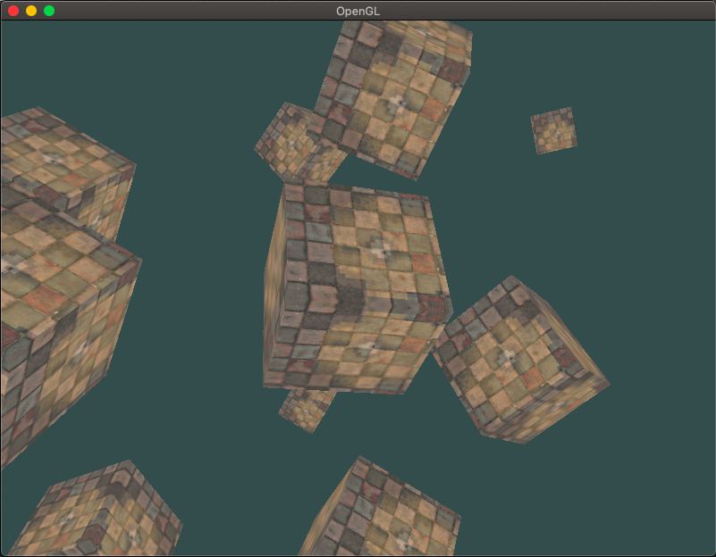

## ##opengl_06

isolated camera class

## ##opengl_07

rebuild a scene with lighting

add textures to the box

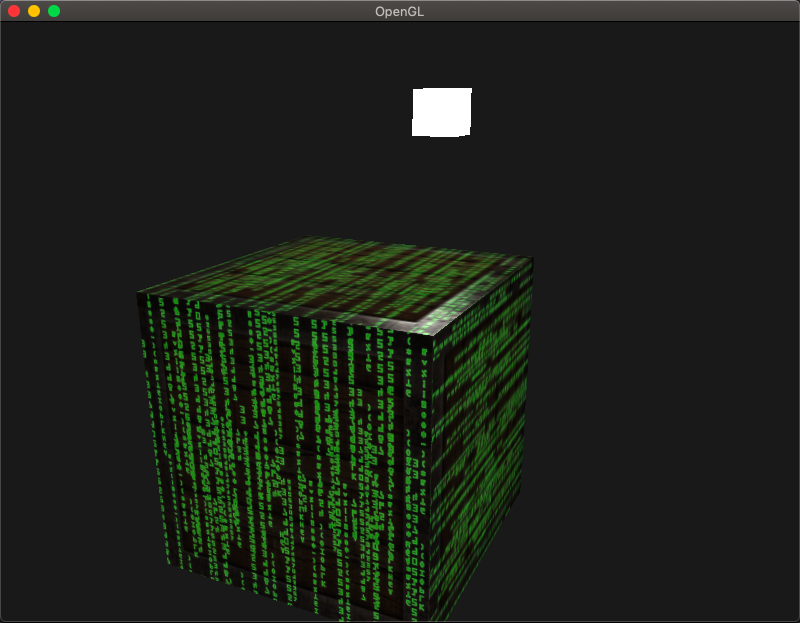

## ##opengl_08

add boxes and more lightings

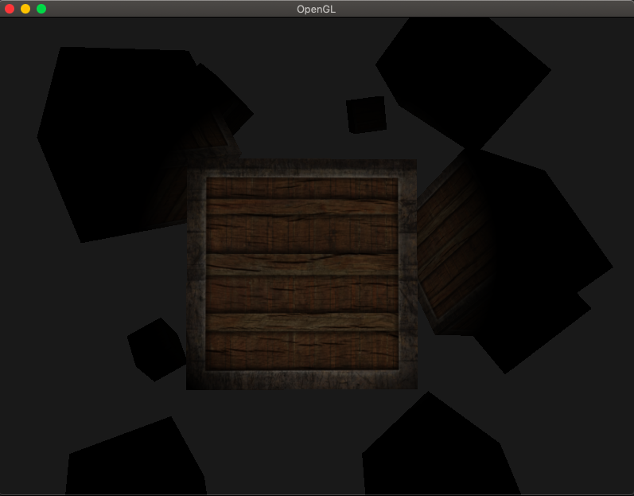

## ##opengl_09

adjust four kinds of lighting styles:

*DESERT/FACTORY/HORROR/BIOCHEMIC*

changing styles by pressing 1/2/3/4

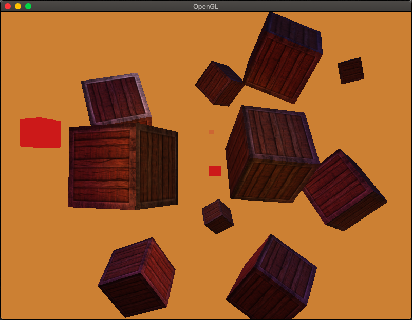

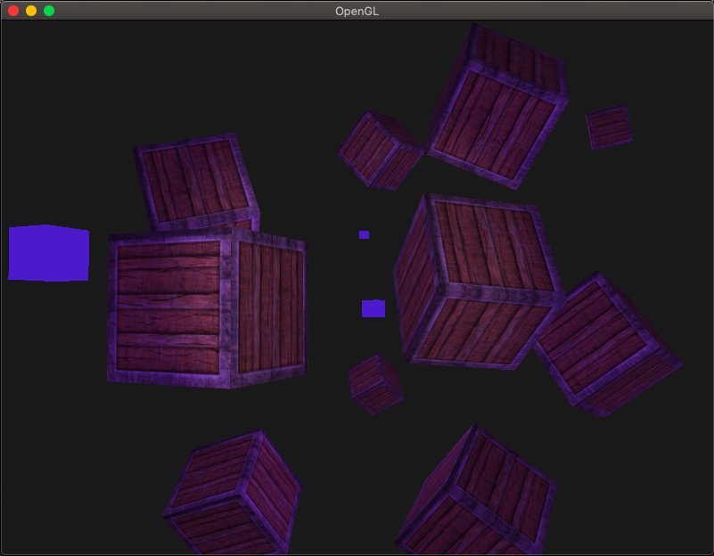

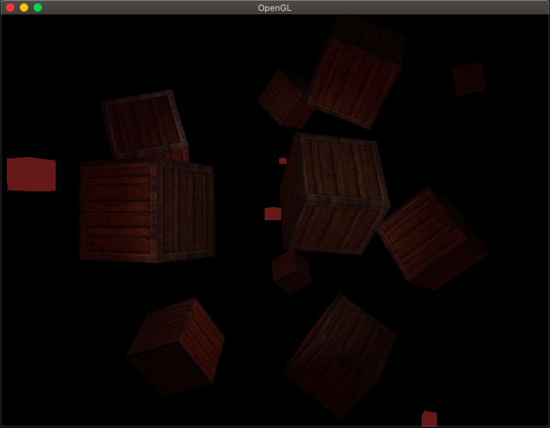

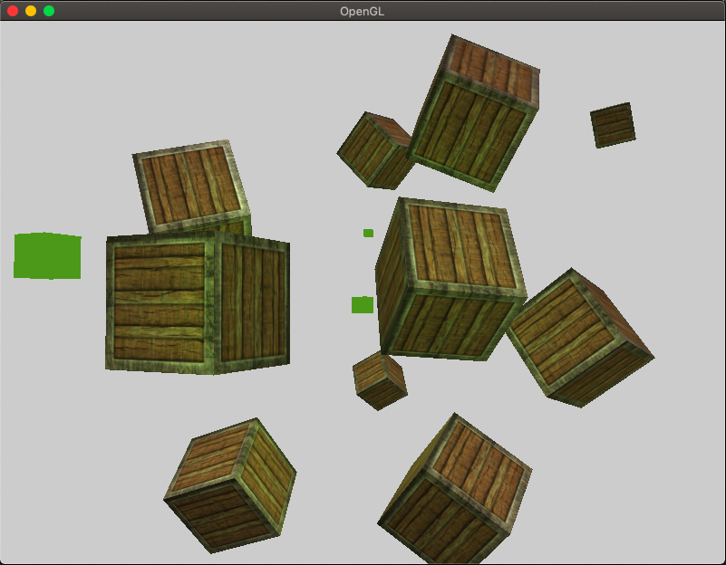

